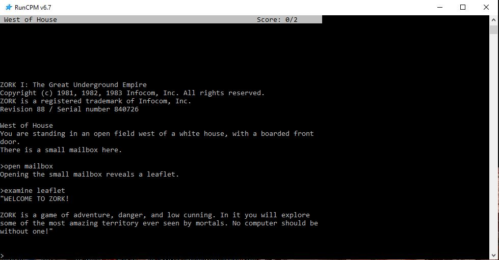

# MyInfocom
All my Infocom discoveries and learning... CPM, Zork and beyond!

## What Do We Have Here Then?
I am interested in CPM, Infocom and, of-course, Zork! Did I mention Zork? I love Zork!

Zork, and all the Infocom games consist of an interpreter and a game data file. The interpreters understand Z-Code, and the game files are written in some version of Z-Code.

So far I have worked only with an interpreter that definitely understands Z-Code v3 (z3) game files.

And before I forget, I have snagged everything from this amazing site:
* https://eblong.com/infocom/

## What Have I Done?
Not much, but it has been interesting and fun, and all with RunCPM v6.7 (64bit) on Windows 10!

* I have taken the CPM Z80 Z-Code interpreter and successfully assembled it with Z80ASM v1.32.
* Fixed a few issues with the original Z80 code to allow a clean assemble.
* Got the Z-Code interpreter working with a common Zork1 (R88 z3) data file.
* Fixed some text display issues, replacing some Wyse terminal codes for VT100/ANSI control codes.
* Worked through the entire Z80 Z-Code interpreter assembly file standardising the formatting and layout (to my liking).
* Continued working through the Z80 Z-Code interpreter assembly file standardising the formatting...

## Whats In This Repo?
* Original files and tool that I pulled together to allow me to do this.
* Reformatted Z80 Z-Code interpreter assembly file for RunCPM (ZORKRCPM.Z80).
* A successfully assembled Zork 1 executable for RunCPM (ZORKRCPM.COM).

## What's Next?
* More examination of the CPM Z80 Z-Code interpreter code.
* Try the assembled Zork1 code on my RC2040.
* Re-assemble the CPM Z80 Z-Code interpreter code for Zork 2, 3 and more.

## Other Comments...
I really like RunCPM!
* https://github.com/MockbaTheBorg/RunCPM/
* https://github.com/guidol70/RunCPM_Windows

The text editor TE is just excellent.
* https://github.com/MiguelVis/te

The Z80 assembler Z80ASM is fantastic.
* https://github.com/JosVermoesen/Z80/tree/master/ASM/Z80ASM

__Enjoy!__

;EOF